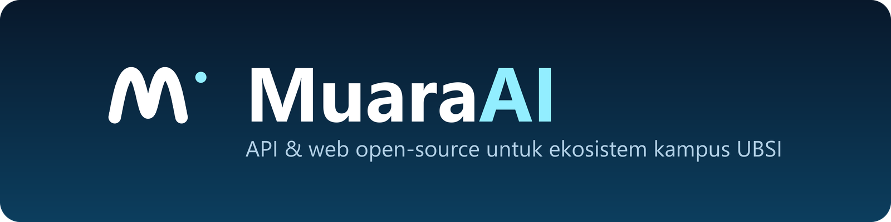

  

# MuaraAI Community

Komunitas open-source dari Indonesia yang berfokus pada API, tooling, dan aplikasi web untuk ekosistem kampus UBSI (Universitas Bina Sarana Informatika). Kami mengubah layanan kampus yang tersebar menjadi API yang terstruktur, terdokumentasi, dan mudah dipakai — dibangun oleh mahasiswa, untuk komunitas.

## Proyek

### [UBSI-API](https://github.com/MuaraAI/UBSI-API)

REST API agregator (tidak resmi) untuk 6 layanan universitas UBSI: SIAKAD, E-Learning, E-Journal, E-Library, Repository, dan News. Dibangun dengan Python dan FastAPI, dilengkapi dokumentasi interaktif (Swagger), cache dua tingkat, dan test suite lengkap.

### web-ubsi

Landing page dan web client untuk UBSI-API di [ubsi-api.muaraai.com](https://ubsi-api.muaraai.com) — dibangun dengan Next.js 15 dan tema Deep Water. (Repositori privat)

## Tautan

- Website: [muaraai.com](https://muaraai.com)
- X (Twitter): [@MuaraAI](https://x.com/MuaraAI)
- Email: [admin@muaraai.com](mailto:admin@muaraai.com)

## Teknologi

Python · FastAPI · Redis · TypeScript · Next.js 15

## Kontribusi

Pertanyaan, saran, atau ingin berkontribusi? Hubungi kami melalui email atau X, atau buka issue pada repositori terkait. Setiap kontribusi — besar maupun kecil — kami sambut dengan senang hati.

---

Proyek komunitas dan tidak berafiliasi resmi dengan Universitas Bina Sarana Informatika.
